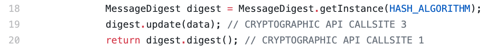

# DL-crypto-api-auto-recommendation
## An open-sourced work for deep learning based cryptographic API recommendation solution.
It includes:
* The code to extract program analysis context for each API method call
* The code for training our Multi-HyLSTM
* The original Android apps that are used as data source.
* The program analysis context (program slices, API dependence graphs) of each Java Cryptographic API method invoation extracted from the Android apps. 

## Program Analysis Part

### CryptoSlicer: Interprocedural Backward slicing
It is a slicing program to extract interprocedural program slices for Java Cryptographic APIs from Android Apps.
#### Running CryptoSlicer with Command:
Run `java -jar CryptoSlicer.jar "app_name" "./output_dir_CryptoSlicer/"`
interatively on all the apps. 

#### Outputs:
* Slice.txt: A file includes the extracted slices of all the scanned apps.
* {app_name}_graph.txt: A file for each scanned app. It includes the information needed to build API dependence graphs for this app. 

#### Prerequisites (Environment Variables)
1. `JAVA_HOME`: Point to a valid Java 8 JDK Installation
2. `ANDROID_SDK_HOME`: Point to a valid Android JDK Installation


### APIDepG: API dependence graph build and path extraction
It builds the API dependence graph on top of the program slices. 
#### Running APIDepG with Command:
* Run 
`python3 APIDepG/Graph_backward.py --data_dir "output_dir" --file {app_name}_graph.txt --vocab_dir "./Data/Vocabulary/Vocabulary.csv"`
iterately on all the output {app_name}_graph.txt files from the CryptoSlicer.

A script to do that:

    FILES=output_dir_CryptoSlicer/*_graph.txt
    for f in $FILES
    do
        echo "Processing $f..."
        output=${f##*/}
        python3 APIDepG/Graph_backward.py --data_dir 'output_dir_paths' --file $f --vocab_dir './APIDepG/Vocabulary.csv'
    done

#### Outputs:
* `dataflow_paths.csv`: A file includes the single paths of all the apps.

## Deep Learning Part
### API and Constant Embedding
We embed the APIs and associated constants as vectors by applying skip-gram model on the extracted dependence paths.
#### Train Embedding with command:

* Run `python3 get_neighbor_pairs.py dependence_path_file.csv neighbor_pairs.csv 1` to extract neighbor pairs of API methods and constants.

* Run command for embedding:
```
python3 embedding_from_pairs.py --training-set-folder 'path/to/neighbor_pairs' 
                                --neighbor-pair-file 'neighbor_pairs.csv' 
                                --embedding-save-path 'embedding_output_dir' 
                                --embedding-name 'dep2vec' 
                                --epoch 100 
                                --batch-size 1024
```
### Multi-HyLSTM Training and Evaluation


## Comparison with Codota
We compare our approach with the state-of-the-art code completion plugin Codota. We manually collect 245 test cases by decompiling 9 Android apps and locating the cryptographic API method invocations in the codebase. The decompiled java source code can be found [here](https://github.com/Anya92929/DL-crypto-api-auto-recommendation/tree/main/Comparison_with_Codota). We marked each test case location with the note "CRYPTOGRAPHIC API CALLSITE xx" so that the test case can be located by searching the keywords "CRYPTOGRAPHIC API CALLSITE". 

An example of the cryptographic API method call in the codebase is as follows:



## Data
Due to the storage limit, we only show part of the data here. The full data can be found at [here](https://drive.google.com/drive/folders/1fc3A3ORcVJUDcPsH2jVHadpgTkbTs8nt?usp=sharing) (preserves viewer anonymity).
Our data includes:
* Android apps (byte code)
* Program-analysis Context
   * Slices
   * Dependence Paths
